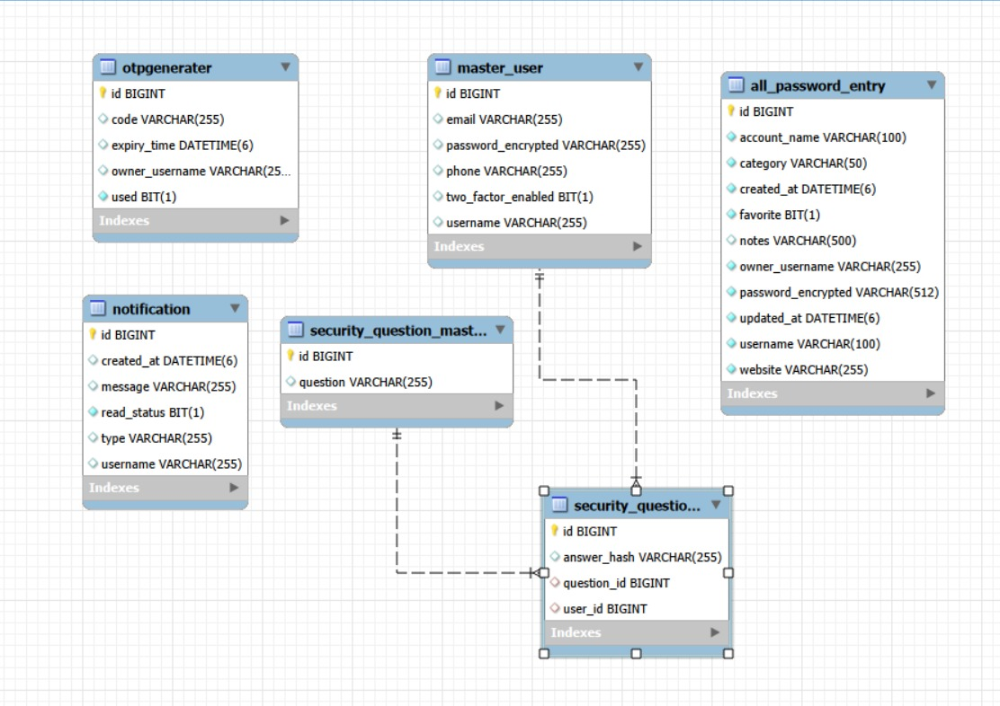

# 🔐 Password Manager

## 📌 Overview

The **Password Manager** is a full-stack web application that allows users to securely store and manage passwords for their online accounts. It includes a password vault, strong password generator, security questions, and authentication features with a focus on data protection and usability.

---

## 🚀 Features

### Authentication & Account

* User registration and login with master password
* Security questions setup and recovery
* Profile update and password change
* Two-Factor Authentication (2FA) simulation
* Secure logout

### Password Vault

* Add, update, delete password entries
* Search, filter, and sort passwords
* Mark favorites
* View details with master password verification

### Password Generator

* Generate strong random passwords
* Customizable length and character options
* Strength indicator

### Security

* Encrypted password storage
* Verification codes for sensitive actions
* Security audit (weak/reused passwords)

---

## 🏗️ Tech Stack

**Frontend:** Angular, TypeScript, HTML, CSS, Bootstrap

**Backend:** Spring Boot, Java, REST APIs, Spring Security, JWT

**Database:** MySQL

---

## 📸 Application Screenshots

---

## 🗂 ERD (Entity Relationship Diagram)

The ERD diagram represents the database structure and relationships between entities such as Users, Password Vault Entries, and Security Questions.

Example:

---

---

---
